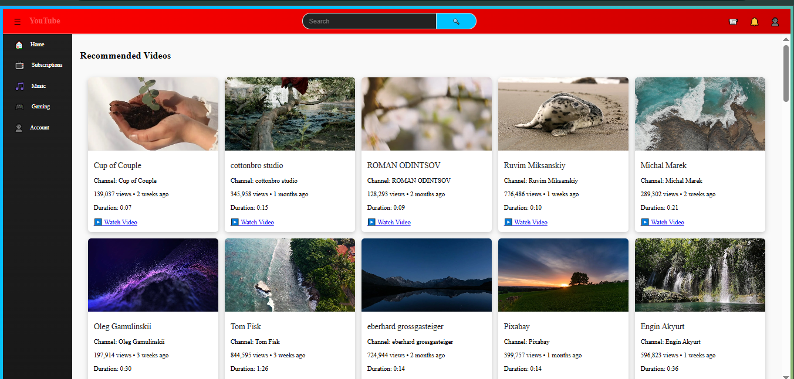

# 🎬 YouTube Clone - React App

A fully responsive **YouTube UI Clone** built with **React.js**, styled beautifully, and powered by **free video and music APIs**.  
This project mimics the look and feel of the real YouTube platform including navigation, sidebar, video grid, search functionality, and music streaming.

## 🎥 YouTube Clone Screenshot
<p style="text-align:center">

</p>
---

## 🚀 Features

- 🎥 Video Cards (thumbnails, views, title, time ago)
- 🔍 Search Bar with functional results
- 📂 Sidebar with menu navigation (Home, Subscriptions, Music, Gaming, Account)
- 👤 Account & Subscriptions section
- 🎶 Music player with preview (powered by iTunes API)
- 📱 Responsive layout using Flexbox & Grid
- 🎨 Gradient background & modern YouTube-like UI
- 💡 Fake views, duration, and upload time for realism
- 🔄 Toggle Sidebar menu
- ✅ Search connects both video & music APIs

---

## 📦 Tech Stack

- React JS (Vite)
- CSS Modules / Plain CSS
- Fetch API (for dynamic data)
- iTunes API (for music)
- Pexels API (for video thumbnails & fake video info)

---

## 🧪 How to Run

```bash
npm install
npm run dev 
```

## 📁 Folder Structure
src/
├── components/
│   ├── Navbar.jsx
│   ├── Sidebar.jsx
│   ├── VideoCard.jsx
│   ├── VideoList.jsx
│   ├── SearchResults.jsx
│   └── ...
├── pages/
│   ├── Home.jsx
│   ├── Music.jsx
│   ├── Account.jsx
│   ├── Subscriptions.jsx
│   └── Game.jsx
├── utils/
│   ├── api.js
│   
├── App.jsx
├── main.jsx
└── index.css
## 🙌 Author
- Majid Ali
- Follow me on LinkedIn
- GitHub: @Majidali90121